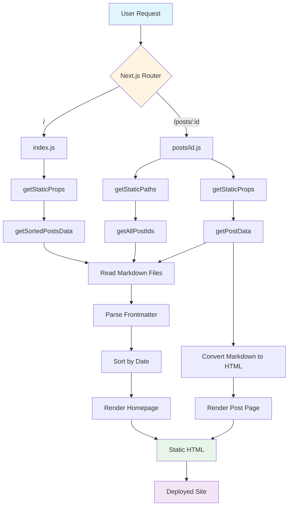
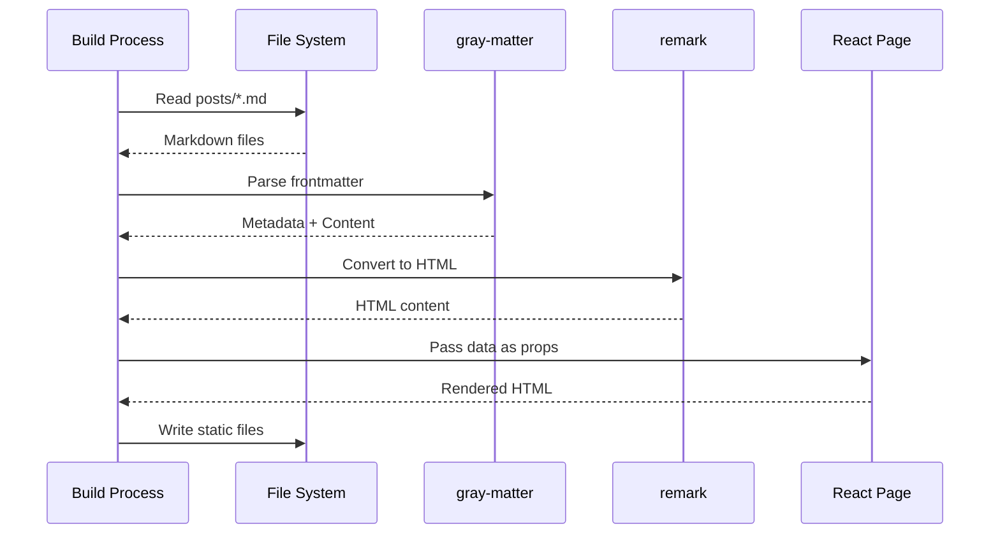

# Next.js Blog

A simple, elegant blog application built with Next.js demonstrating Static Site Generation (SSG), file-based routing, and Markdown-based content management.

Built in October 2020 following the official [Next.js tutorial](https://nextjs.org/learn/basics/create-nextjs-app).

## Features

- 📝 Markdown-based blog posts with frontmatter
- ⚡ Static Site Generation (SSG) for optimal performance
- 🎨 CSS Modules for component-scoped styling
- 📅 Date formatting with date-fns
- 🔄 File-based routing with Next.js
- 🎯 Pre-rendered pages for fast loading
- 📱 Responsive design
- 🚀 Ready for deployment to Vercel, Netlify, or any static hosting

## Getting Started

### Prerequisites

- Node.js (v12 or higher)
- npm or yarn

### Installation

1. Clone the repository:
```bash
git clone https://github.com/orassayag/nextjs-blog.git
cd nextjs-blog
```

2. Install dependencies:
```bash
npm install
```

3. Run the development server:
```bash
npm run dev
```

4. Open [http://localhost:3000](http://localhost:3000) in your browser

## Available Scripts

### Development
Start the development server with hot reloading:
```bash
npm run dev
```

### Build
Create an optimized production build:
```bash
npm run build
```

### Start
Run the production server (requires build first):
```bash
npm run start
```

### Stop (Windows)
Stop all Node.js processes:
```bash
npm run stop
```

## Project Structure

```
nextjs-blog/
├── components/          # Reusable React components
│   ├── layout.js       # Main layout wrapper
│   ├── date.js         # Date formatting component
│   ├── alert.js        # Alert component
│   └── *.module.css    # Component-specific styles
├── lib/                # Utility functions
│   └── posts.js        # Post reading and processing
├── pages/              # Next.js pages (file-based routing)
│   ├── index.js        # Homepage
│   ├── posts/
│   │   └── [id].js     # Dynamic post pages
│   ├── _app.js         # Custom App component
│   └── api/
│       └── hello.js    # Example API route
├── posts/              # Markdown blog posts
│   ├── pre-rendering.md
│   └── ssg-ssr.md
├── public/             # Static assets
│   ├── images/
│   └── favicon.ico
├── styles/             # Global and utility styles
│   ├── global.css
│   └── utils.module.css
├── .eslintrc.js        # ESLint configuration
├── next.config.js      # Next.js configuration
└── package.json
```

## Architecture



## How It Works

### Static Site Generation

The blog uses Next.js Static Site Generation (SSG) to pre-render all pages at build time:

1. **Homepage** (`pages/index.js`):
   - Uses `getStaticProps()` to fetch all posts at build time
   - Reads Markdown files from `posts/` directory
   - Parses frontmatter and sorts posts by date
   - Generates static HTML with the post list

2. **Post Pages** (`pages/posts/[id].js`):
   - Uses `getStaticPaths()` to generate paths for all posts
   - Uses `getStaticProps()` to fetch individual post data
   - Converts Markdown to HTML using `remark` and `remark-html`
   - Generates static HTML for each post

### Data Flow



## Adding New Posts

Create a new Markdown file in the `posts/` directory:

```markdown
---
title: 'My New Blog Post'
date: '2024-03-05'
---

Write your content here using **Markdown** syntax.

- Lists
- Links
- Code blocks
- And more!
```

The post will automatically:
- Appear on the homepage
- Be accessible at `/posts/my-new-blog-post`
- Be sorted by date
- Be pre-rendered as static HTML

## Customization

### Changing Site Information

Edit `components/layout.js`:
```javascript
const name = 'Your Name';
export const siteTitle = 'Your Site Title';
```

### Adding New Pages

Create a new file in `pages/`:
```javascript
// pages/about.js
export default function About() {
  return <div>About page</div>
}
```

Accessible at `/about`

### Styling

- Global styles: `styles/global.css`
- Utility classes: `styles/utils.module.css`
- Component styles: Create `*.module.css` files

## Deployment

### Vercel (Recommended)

1. Push your code to GitHub
2. Import the repository in [Vercel](https://vercel.com)
3. Vercel automatically detects Next.js and deploys

### Netlify

1. Push your code to GitHub
2. Create a new site in [Netlify](https://netlify.com)
3. Configure build settings:
   - Build command: `npm run build`
   - Publish directory: `.next`

### Static Export

For fully static hosting:
```bash
npm run build
npm run export
```

Deploy the `out/` directory to any static host.

## Technologies Used

- **Next.js** (v10.0.0) - React framework for production
- **React** (v16.13.1) - UI library
- **gray-matter** - Parse YAML frontmatter from Markdown
- **remark** & **remark-html** - Markdown processing
- **date-fns** - Date formatting
- **classnames** - Conditional CSS classes

## Learning Resources

This project is based on the official Next.js tutorial:
- [Learn Next.js](https://nextjs.org/learn/basics/create-nextjs-app)
- [Next.js Documentation](https://nextjs.org/docs)
- [Next.js GitHub](https://github.com/vercel/next.js/)

## Contributing

Contributions to this project are [released](https://help.github.com/articles/github-terms-of-service/#6-contributions-under-repository-license) to the public under the [project's open source license](LICENSE).

Everyone is welcome to contribute. Contributing doesn't just mean submitting pull requests—there are many different ways to get involved, including answering questions and reporting issues.

Please feel free to contact me with any question, comment, pull-request, issue, or any other thing you have in mind.

## Author

* **Or Assayag** - *Initial work* - [orassayag](https://github.com/orassayag)
* Or Assayag <orassayag@gmail.com>
* GitHub: https://github.com/orassayag
* StackOverflow: https://stackoverflow.com/users/4442606/or-assayag?tab=profile
* LinkedIn: https://linkedin.com/in/orassayag

## License

This application has an MIT license - see the [LICENSE](LICENSE) file for details.
